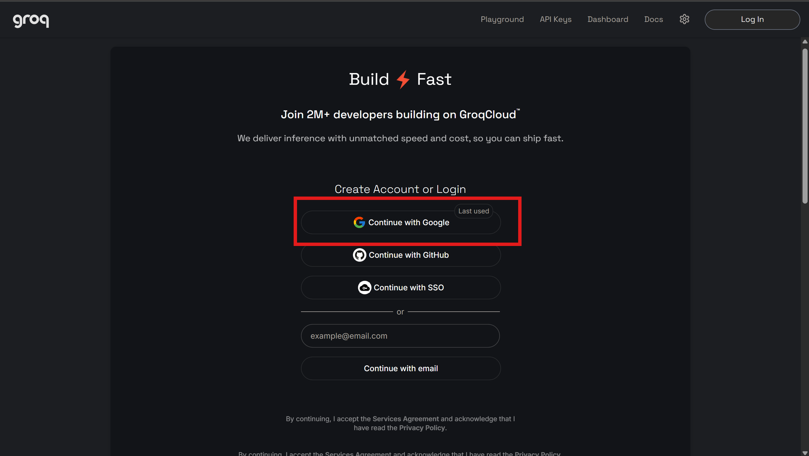

# Installing Piplo on a Mac

Piplo lets you hold a shortcut, speak, and have clean text appear in whatever
app you were already using.

Setting it up takes about five minutes. There are four steps and **none of them
are optional** — Piplo will not work until all four are done. macOS is strict
about apps that listen to your microphone and type on your behalf, which is
reasonable, and it means a few permission screens up front.

Piplo is not signed by Apple yet, so macOS will be suspicious of it in step 1.
That is expected and step 1 explains exactly what to click.

---

## Step 1 — Open the app

1. Open the `.dmg` file you were sent.
2. Drag **Piplo** into your **Applications** folder.
3. Open your Applications folder and double-click **Piplo**.

**You will probably see this:**

> **"Piplo" is damaged and can't be opened. You should move it to the Trash.**

Nothing is damaged. macOS shows this for any app not signed with a paid Apple
developer certificate. To get past it:

1. Open **System Settings**
2. Go to **Privacy & Security**
3. Scroll down — near the bottom there will be a line saying *"Piplo" was
   blocked* with an **Open Anyway** button
4. Click **Open Anyway**, then confirm with your password or Touch ID

> On older macOS versions you can instead right-click Piplo and choose **Open**.
> On macOS 15 (Sequoia) and later, Apple removed that shortcut and the System
> Settings route above is the only way.

**If "Open Anyway" doesn't appear**, open the **Terminal** app, paste this line
exactly, and press Return:

```
xattr -cr /Applications/Piplo.app
```

It won't print anything. Then double-click Piplo again and it will open
normally.

Once Piplo opens you will see its window, and a small microphone chip near the
bottom of your screen. That chip is Piplo — it stays there, floating above your
other windows.

---

## Step 2 — Add a Groq API key

Piplo sends your audio to Groq to be turned into text, so it needs a key. It's
free.

### ⚠️ Sign up with "Continue with Google"

> Groq's login screen offers several ways in. **Use "Continue with Google"** —
> the top button, with the coloured G, outlined in red below.
>
> **Do not use "Continue with email"** at the bottom. That route does not create
> a fully working account: you can sign in, but you won't be able to create a
> usable API key, and nothing on the page tells you that's the reason. If you've
> already signed up that way, just sign in again with Google instead.



Then:

1. Go to **https://console.groq.com/keys** and **Continue with Google**
2. Click **Create API Key**, give it any name, and copy the key
3. In Piplo, click **Settings** in the left sidebar
4. Paste the key into the **API key** box and save

The key is stored on your Mac only. **Copy it as soon as it's created** — Groq
won't show it to you a second time. If you lose it, delete it and make a new one.

---

## Step 3 — Allow the microphone

The first time you dictate, macOS will ask whether Piplo can use your
microphone. Click **Allow**.

If you clicked "Don't Allow" by accident: **System Settings → Privacy &
Security → Microphone**, and switch **Piplo** on.

---

## Step 4 — Allow Piplo to type (the important one)

This is the step people miss, and if you skip it Piplo will seem to work
perfectly while typing nothing at all.

macOS will not let any app type on your behalf without explicit permission,
because that is also how keyloggers work.

1. Open **System Settings**
2. Go to **Privacy & Security → Accessibility**
3. Find **Piplo** in the list and switch it **on**
   - If Piplo isn't listed, click **+**, then choose Piplo from Applications
4. **Quit Piplo completely and open it again**

That last part matters. macOS only hands the permission to Piplo when it next
starts, so without the restart nothing changes.

---

## Using it

Hold the shortcut shown on Piplo's Home screen — **Ctrl + Space** by default —
speak, then let go. The text appears wherever your cursor was.

- **Hold** the shortcut while speaking. Don't tap it.
- Piplo tidies up your grammar automatically. Nothing to turn on.
- Every dictation is saved under **Home**, so nothing is ever lost.
- Right-click the floating chip for a quick menu.
- Closing the Piplo window doesn't quit it — it keeps running in the menu bar.

If **Ctrl + Space** does something unwanted on your Mac (on some setups it
switches keyboard languages), change it in **Settings → Shortcut**.

---

## If something goes wrong

| What you see | What it means |
| ------------ | ------------- |
| The chip says **"needs Accessibility permission"** and nothing gets typed | Step 4 isn't finished. Your words aren't lost — they're on your clipboard, so press **Cmd + V** to paste. Then redo step 4, including the restart. |
| Nothing is typed and no message appears | Check under **Home** — if the dictation is listed there, it was transcribed and the problem is step 4. If it isn't listed, the problem is earlier. |
| The chip says **"No API key"** | Step 2 isn't finished. |
| Groq won't let you create an API key, or the key it gave you is rejected | You almost certainly signed up with **Continue with email**. Sign in again using **Continue with Google** and create the key from that account — see step 2. |
| The chip flashes an error straight away | Usually no internet, or the API key was pasted with a missing character. Try creating a fresh key. |
| Nothing happens at all when you hold the shortcut | Another app has claimed the same shortcut. Pick a different one in **Settings → Shortcut**. |
| The text appears inside Piplo instead of your document | This shouldn't happen — please report it, it's a real bug. |
| **"Piplo is damaged"** even after step 1 | Use the `xattr -cr` command in step 1. |

### When you get an updated version

macOS ties the Accessibility permission to the exact app it was granted to, and
an updated Piplo counts as a different app. So after replacing it:

1. **System Settings → Privacy & Security → Accessibility**
2. Select the old **Piplo** entry and remove it with the **−** button
3. Add the new one with **+**, and switch it on
4. Quit and reopen Piplo

Skip this and typing will silently stop working, which looks exactly like the
new version being broken.

### Reporting a problem

Four things make a problem fixable quickly:

1. Your macOS version — **Apple menu → About This Mac**
2. Whether your Mac is **Apple Silicon** or **Intel** — same screen
3. A photo or screenshot of the message on the chip
4. The log, if you can manage it:
   - Open the **Terminal** app
   - Paste `/Applications/Piplo.app/Contents/MacOS/piplo` and press Return
   - Use Piplo as normal, then copy whatever Terminal printed

Every line Piplo prints starting with `piplo:` is it telling you what went
wrong, so that log usually contains the answer outright.
